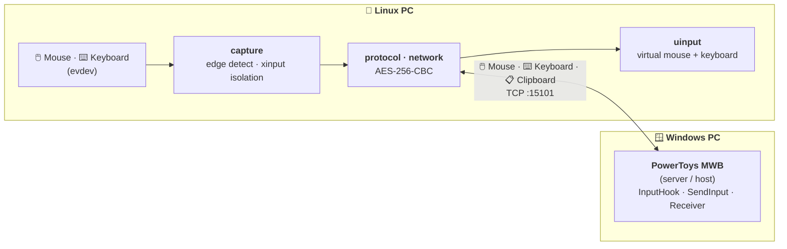
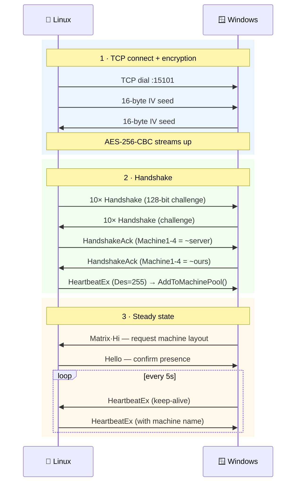
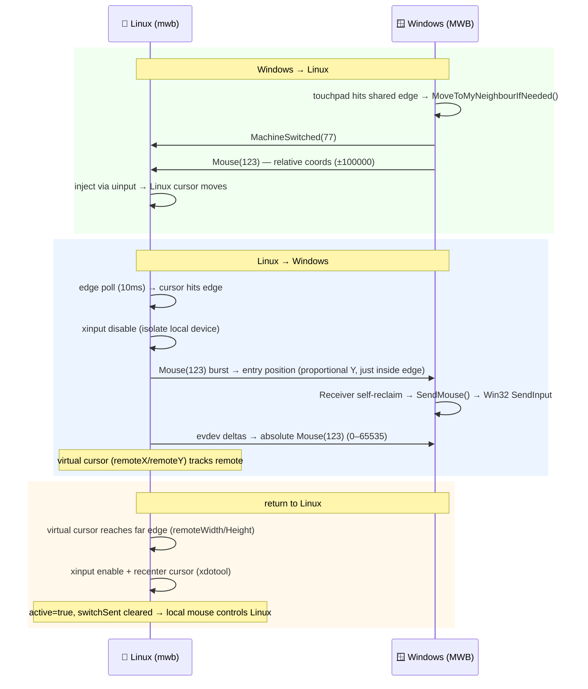

# MWB Bidirectional Architecture

## Overview

This is a Linux client for Microsoft PowerToys Mouse Without Borders (MWB) that enables **bidirectional** keyboard and mouse sharing between a Linux PC and a Windows laptop over the local network. It implements MWB host-mode (sending input, not just receiving) from Linux, building on the receive-only [bketelsen/mwb](https://github.com/bketelsen/mwb) client.

## How It Works



Local input is read from `evdev`, forwarded to Windows as encrypted MWB packets,
and incoming Windows input is injected through a `uinput` virtual device.

## Connection Lifecycle



**Key derivation**: `PBKDF2(SHA512, securityKey, UTF16LE("18446744073709551615"), 50000 iterations) → 32-byte AES key`

**Fixed IV**: ASCII bytes of `"1844674407370955"` (first 16 chars of uint64.MaxValue)

## Cursor Switching Protocol



## Packet Wire Format

### Standard Packet (32 bytes)

```
Offset  Size  Field
──────  ────  ─────
0       1     Type (PackageType enum)
1       1     Checksum (sum of bytes 2-31)
2-3     2     Magic number (24-bit hash of security key)
4-7     4     Packet ID (int32, little-endian, must be non-zero)
8-11    4     Src machine ID (uint32)
12-15   4     Des machine ID (uint32, or 255=broadcast)
16-31   16    Payload union (Mouse/Keyboard/Handshake data)
```

### Extended Packet (64 bytes)

Same as above, plus:
```
32-63   32    Machine name (ASCII, space-padded)
```

### Mouse Payload (bytes 16-31)

```
16-19   4     X (int32) — absolute 0-65535, or relative ±100000+delta
20-23   4     Y (int32) — absolute 0-65535, or relative ±100000+delta
24-27   4     WheelDelta (int32) — 120 = one notch
28-31   4     DwFlags (int32) — WM_MOUSEMOVE=0x200, WM_LBUTTONDOWN=0x201, etc.
```

### Keyboard Payload (bytes 16-31)

```
16-23   8     DateTime (int64) — usually 0
24-27   4     WVk (int32) — Windows Virtual Key code
28-31   4     DwFlags (int32) — 0=keydown, 0x80=keyup, 0x01=extended
```

Inbound keyboard handling maps `WVk` to Linux evdev key codes through a layout
profile (`keyboard_layout`). This is required because Windows virtual-key codes
are layout-sensitive for non-US layouts, while Linux `uinput` injects physical
evdev key positions that the local XKB layout then resolves to characters.
Current PowerToys MWB packets do not include the Windows hardware scan code or
Unicode text, so fully zero-config global layout support requires additional
sender metadata. Supported receive profiles currently cover common Windows
Latin/ISO layouts (`us`, `de`, `fr`, `be`, `es`, `it`, `gb`, `pt`, Nordic,
Swiss, and Dutch); unknown profiles fall back to the original US-compatible
mapping.

## Key Packet Types

| Type | Value | Direction | Purpose |
|------|-------|-----------|---------|
| Hi | 2 | Server→Client | Device discovery ping |
| Hello | 3 | Client→Server | Discovery response (includes machine name) |
| ByeBye | 4 | Either | Disconnect notification |
| Heartbeat | 20 | Either | Keep-alive |
| HeartbeatEx | 51 | Either | Extended keep-alive (with machine name) |
| HideMouse | 50 | Server→Client | Tell old remote to hide cursor |
| MachineSwitched | 77 | Server→Client | Cursor now on your machine |
| NextMachine | 121 | Client→Server | Request cursor switch to another machine |
| Keyboard | 122 | Either | Keyboard input event |
| Mouse | 123 | Either | Mouse input event |
| Handshake | 126 | Either | Challenge during connection setup |
| HandshakeAck | 127 | Either | Challenge response (bitwise NOT) |
| Matrix\|* | 128+ | Server→Client | Machine layout information |

## Critical Implementation Details

### 1. Packet ID Must Be Non-Zero
The server has a zero-initialized dedup ring buffer. ID=0 packets are silently dropped.

### 2. HandshakeAck Src Must Be Our MachineID
If Src=0, server stores ID.NONE and never routes packets to our socket.

### 3. HeartbeatEx After Handshake
Must send HeartbeatEx with Des=255 (broadcast) to trigger AddToMachinePool() on the server.

### 4. Matrix Packet Handling
Server sends Matrix|Hi (type 130 = 128|2) packets. We must respond with Hello to be registered in the machine layout. Without this, the server's edge detection doesn't know we exist.

### 5. Absolute vs Relative Mouse
- **Absolute** (0-65535): Server calls `InputSimulation.SendMouse()`, no edge checking
- **Relative** (±100000 sentinel): Server calls `MoveMouseRelative()`, then checks edges via `MoveToMyNeighbourIfNeeded()`

With "Move mouse relatively" **OFF** on the server, absolute mode avoids bounce-back issues.

### 6. xinput for Device Isolation
When controlling the remote, `xinput disable` prevents the local device from moving the Ubuntu cursor. `xinput enable` restores it when returning. This is more reliable than EVIOCGRAB which had issues with device restoration.

### 7. Timing and Debouncing
- **Edge polling**: 10ms ticker (`pollCursorEdge`, `capture_linux.go`)
- **Switch gating**: `canSwitch`/`canReturn` gates prevent re-trigger loops — no
  time-based cooldown. The cursor must move away from the edge before another
  switch can fire. A 100ms `lastSwitch` debounce guards against rapid double-fire.
- **Switch grace**: 100ms evdev suppression after sending switch packets
  (`handleEvent`, `capture_linux.go`)

## Package Structure

```
cmd/mwb/main.go              Entry point, flag parsing, connection loop
internal/
  config/config.go            TOML config loading (~/.config/mwb/config.toml)
  protocol/
    types.go                  Packet type constants, message flags
    packet.go                 Packet struct, Marshal/Unmarshal
    crypto.go                 AES key derivation, magic number, stamp/validate
    stream.go                 EncryptWriter, DecryptReader (AES-256-CBC)
  network/
    client.go                 TCP connection, IV exchange, handshake, Send/Recv
    receiver.go               Main receive loop, heartbeat/matrix handling
    handler.go                Mouse/Keyboard injection, MachineSwitched/NextMachine callbacks
  input/
    uinput.go                 Virtual mouse/keyboard via /dev/uinput
    keymap_linux.go           Windows VK → Linux evdev mapping
    reverse_keymap_linux.go   Linux evdev → Windows VK mapping
    buttons.go                BTN_LEFT/RIGHT/MIDDLE constants
  capture/
    capture_linux.go          Edge detection, evdev monitoring, xinput grab, remote cursor tracking
    screen_linux.go           Screen resolution via xrandr
```

## Configuration

```toml
# ~/.config/mwb/config.toml
host = "192.168.1.100"        # Windows machine IP
key = "YourSecurityKey"       # Must match PowerToys MWB security key
name = "linux"                 # Machine name (max 15 chars)
port = 15100                   # Base port (message port = 15101)
keyboard_layout = "auto"       # Inbound keyboard mapping profile
```

## Running

```bash
# Basic (receive only — Windows controls Linux)
mwb

# Bidirectional (Linux can also control Windows)
sudo mwb -bidi -edge left

# With debug logging
sudo mwb -bidi -edge left -debug
```

## Requirements

### Windows Side
- PowerToys with Mouse Without Borders enabled
- "Move mouse relatively" set to **OFF**
- Security key generated and shared

### Linux Side
- `/dev/uinput` accessible (user in `input` group)
- `xdotool` installed (for cursor position polling)
- `xinput` installed (for device isolation)
- `xrandr` installed (for screen detection)
- Run with `sudo` for evdev access, or configure udev rules

## Critical Invariants

These are non-obvious rules that **must not be broken** by refactoring.
Each has caused a production bug when violated.

### Mutex: never hold `c.mu` when calling `enableXinput()` / `disableXinput()`

Both methods acquire `c.mu` internally. Calling them while already holding `c.mu`
causes an immediate deadlock — Go's `sync.Mutex` is not reentrant. `SetActive` and
`handleRel` release `c.mu` explicitly before calling these methods.

```go
// WRONG — deadlock
func (c *Capturer) SetActive(active bool) {
    c.mu.Lock()
    defer c.mu.Unlock()
    c.enableXinput() // tries to acquire c.mu → deadlock
}

// CORRECT
func (c *Capturer) SetActive(active bool) {
    c.mu.Lock()
    // ... update state ...
    c.mu.Unlock()   // release first
    c.enableXinput() // then call
}
```

### xinput: NEVER call `enable`/`disable` on `[floating slave]` devices

Floating slaves are already detached from the X11 master pointer/keyboard.
Calling `xinput enable` or `xinput disable` on them corrupts their state,
and they require manual recovery (`xinput reattach` + `xinput enable`).

`parseXinputIDs` skips any line containing `[floating slave]`. This filter
must be preserved. **Test:** `TestParseXinputIDs_SkipsFloatingSlaves`.

### xinput: `enableXinput()` only when `disabledXinputIDs` is non-empty (or as cleanup)

Calling `enableXinput()` unconditionally at startup or on reconnect will run
`xinput enable` on attached devices. While this is idempotent for enabled
devices, it must never be called on floating devices (see above). `New()` does
not call `enableXinput()` — `Stop()` handles cleanup for the cycle.

### Cursor position: both `OnActivated` and `OnReclaimed` must move cursor away from edge

When the cursor returns to Ubuntu (via either `MachineSwitched` or `NextMachine`),
it arrives at the switch edge (e.g. `x=0` for a left-edge setup). Without
a `xdotool mousemove` call, the cursor stays at the edge, `canSwitch` never
arms, and the user's mouse appears frozen. Both callbacks must call
`SafeEntryPosition()` and move the cursor 100px inside.

### `Stop()` must drain goroutines before returning

`monitorDevice` goroutines block on `f.Read()` indefinitely. Without closing
the device file descriptors and waiting on the `WaitGroup`, goroutines accumulate
across reconnect cycles (35 devices × N reconnects). `Stop()` closes all stored
`deviceFiles` and calls `c.wg.Wait()`.

### `SendPacket` must hold `sendMu` for the full `enc.Write` call

`cipher.CBCEncrypter` is NOT goroutine-safe — it mutates internal IV state on
every call. Concurrent `SendPacket` calls from heartbeat, clipboard, and capture
goroutines corrupt the CBC stream. The `sendMu sync.Mutex` on `Conn` serializes
all writes.

---

## Future Work

- [x] Wayland native bidirectional input (InputCapture portal + libei; `-tags wayland`)
- [x] File copy/paste over the separate clipboard channel (base port 15100):
      AES + IV handshake, 64-byte DATA header, then a 1024-byte UTF-16LE
      `"<size>*<name>"` header followed by the raw file bytes.
- [ ] File drag-and-drop (the interactive drag path, distinct from copy/paste)
- [ ] Multi-monitor support
- [ ] Native multi-machine layout grid (PowerToys-style)
- [ ] Replace xdotool polling with XInput2 RawMotion events (100 forks/sec → 0)
- [ ] Replace xinput name-matching with EVIOCGRAB (vendor-agnostic isolation)
- [ ] Virtual cursor drift correction (wire UpdateRemoteScreen to incoming abs coords)
- [ ] Smoother cursor transition animations
